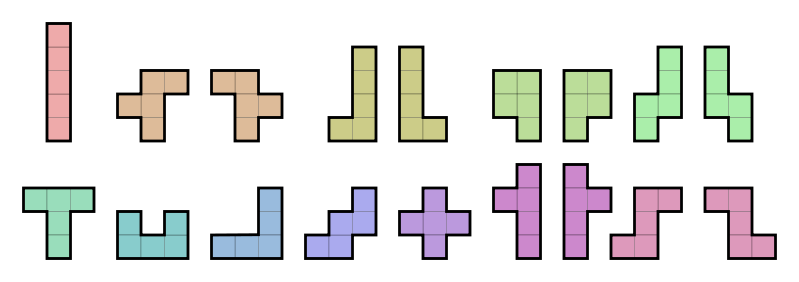

pentamino
=========

tool for solve pentamino problem (http://en.wikipedia.org/wiki/Pentomino)

For start solve pentomino task run main.py:

    $ pentamino/./main.py -c -o -p -n 2
    decision #1
    solved by 0.001474 seconds
    +---+---+---+---+---+---+---+---+
    |           |   |           |   |
    +   +---+---+   +   +---+   +   +
    |   |           |   |   |   |   |
    +   +   +---+---+---+   +---+   +
    |   |   |       |           |   |
    +---+---+   +---+---+   +---+   +
    |   |       |       |   |   |   |
    +   +---+   +       +---+   +   +
    |       |   |       |       |   |
    +   +---+---+---+---+   +---+---+
    |   |   |       |       |       |
    +   +   +       +---+---+   +---+
    |   |   |       |           |   |
    +---+   +---+   +---+---+---+   +
    |           |   |               |
    +---+---+---+---+---+---+---+---+

    decision #2
    solved by 2.484188 seconds
    +---+---+---+---+---+---+---+---+
    |           |   |       |       |
    +   +---+---+   +---+   +---+   +
    |   |           |   |       |   |
    +   +   +---+---+   +---+   +   +
    |   |   |   |           |   |   |
    +---+---+   +---+---+   +---+   +
    |   |       |       |   |   |   |
    +   +       +       +---+   +---+
    |   |       |       |           |
    +   +---+---+---+---+---+   +---+
    |   |       |           |   |   |
    +   +   +---+   +---+---+---+   +
    |   |   |       |   |           |
    +   +   +---+---+   +---+---+   +
    |   |       |               |   |
    +---+---+---+---+---+---+---+---+

    total time: 2.4882068634

Options of usage:

    $ pentamino/./main.py -h
    usage: main.py [-h] [-n NUMBER_DECISIONS] [-c] [-p] [-o]

    optional arguments:
      -h, --help            show this help message and exit
      -n NUMBER_DECISIONS, --number-decisions NUMBER_DECISIONS
                            need decisions count
      -c, --center-square   show decisions where square figure placed in center
      -p, --pretty-print    pretty print decisions (a bit slow)
      -o, --only-original   output only original decisions (which are not repeated
                            by rotations and reflections)